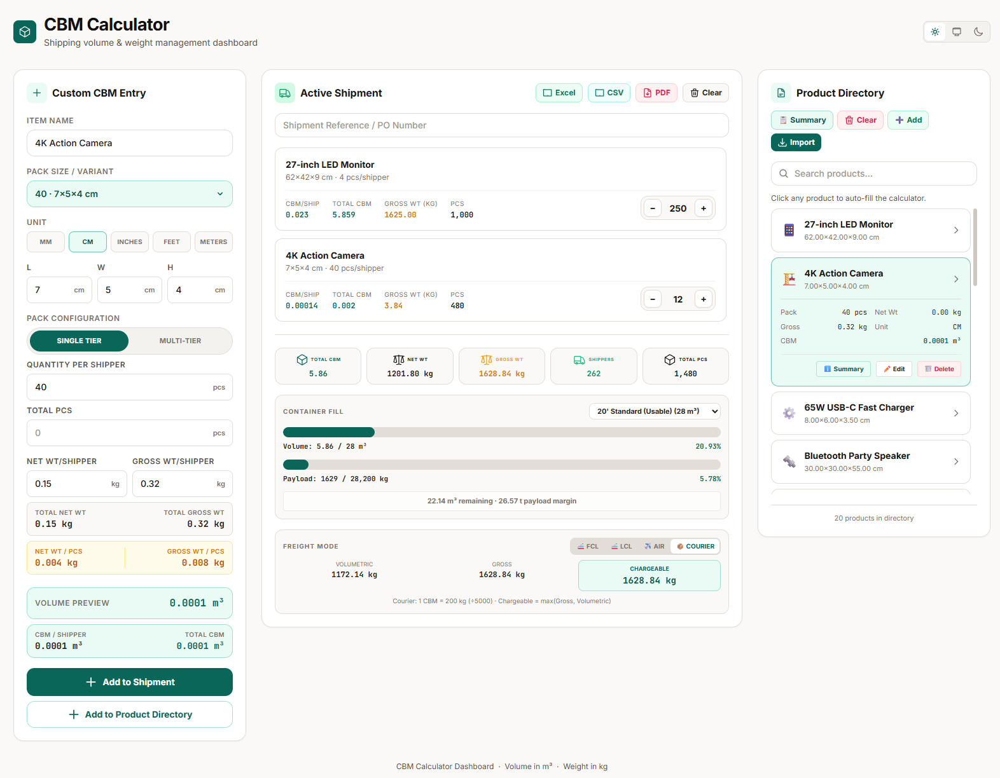
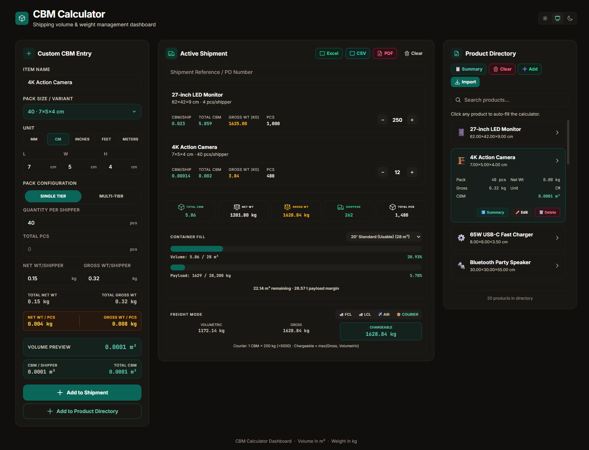
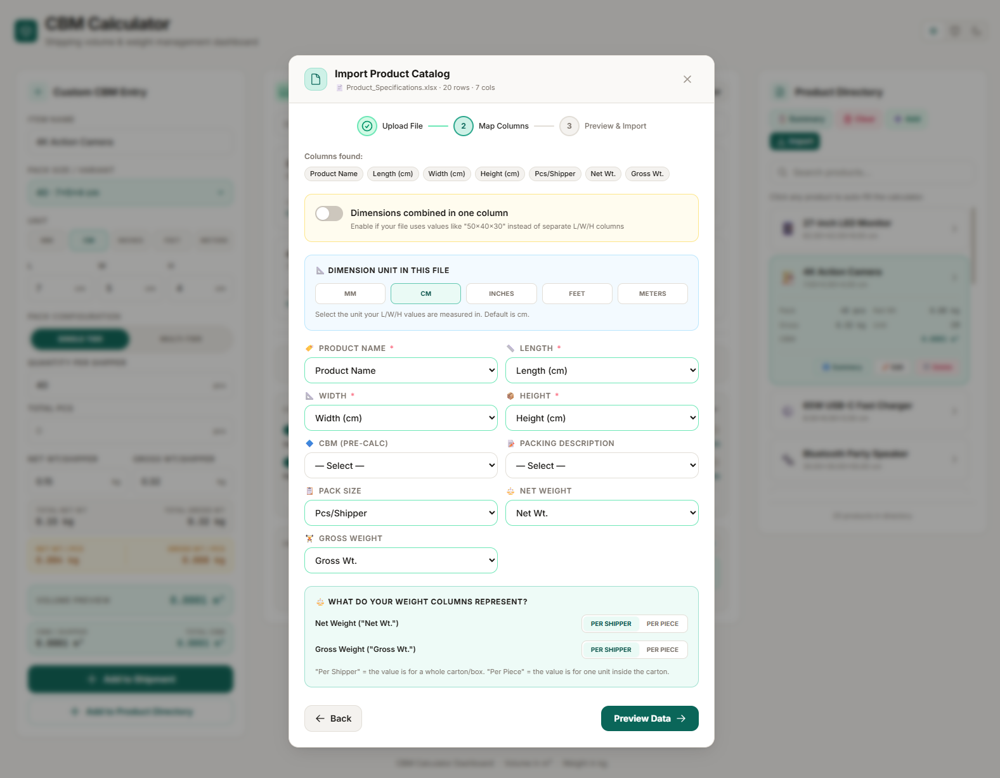
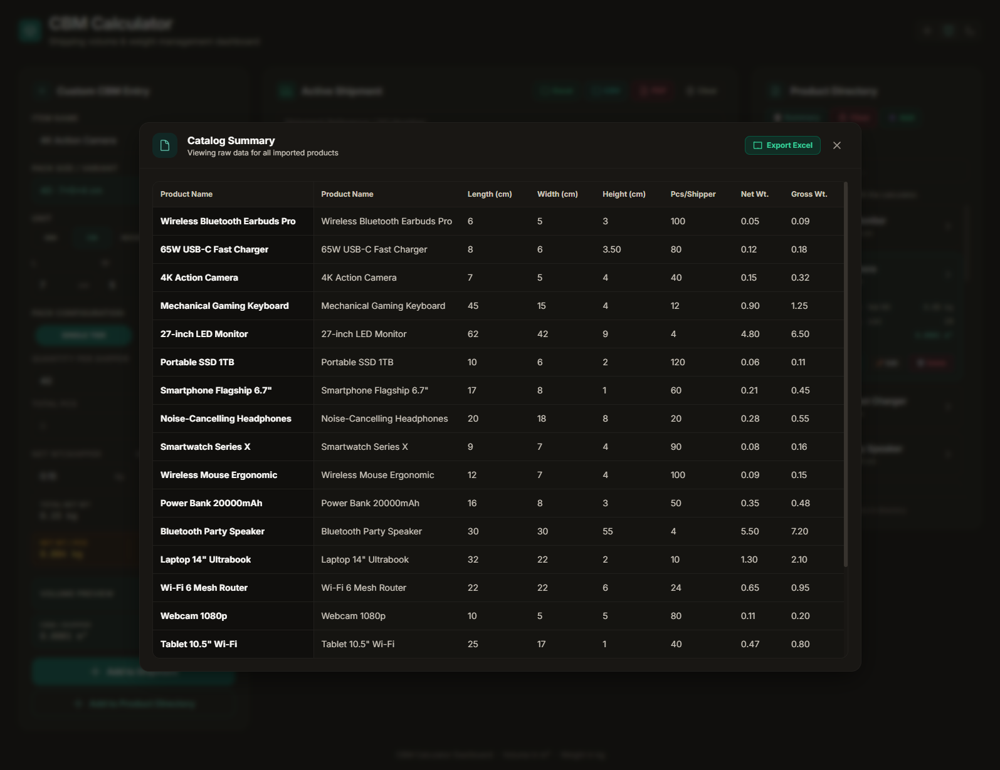

<div align="center">

# 📦 CBM Calculator

**Professional shipping volume & weight management dashboard**

[](https://react.dev/)
[](https://vitejs.dev/)
[](https://tailwindcss.com/)
[](LICENSE)

[Live Demo](https://advanced-cbm-calculator.web.app) · [Report Bug](https://github.com/Hardik0332/Advanced-CBM-Calculator/issues) · [Request Feature](https://github.com/Hardik0332/Advanced-CBM-Calculator/issues)

</div>

---

<div align="center">
  
</div>

> A fast, offline-capable web app for logistics professionals to calculate cubic meters (CBM), manage product catalogs, track shipments, and export reports — all in one polished three-panel dashboard. No backend, no sign-up; everything persists locally.

---

## 🖥️ Screenshots

| Light Mode | Dark Mode |
|:---:|:---:|
|  |  |

| Import Wizard | Product Summary |
|:---:|:---:|
|  |  |

> 📸 Screenshots live in [`docs/screenshots/`](docs/screenshots/). Replace the placeholders with your own captures — the tables above render them automatically.

---

## ✨ Features

### 🧮 Custom CBM Entry
- Calculate CBM from L × W × H with instant unit conversion — **mm, cm, inches, feet, meters**
- Single-tier and multi-tier pack configurations
- Live CBM/shipper and total PCS preview as you type

### 🚢 Active Shipment Management
- Add products from the calculator or directory with one click
- Real-time **container fill** progress bar (volume + payload)
- Supports **20′, 40′, and 40′ High Cube** containers with usable-volume and max-payload limits
- Overfill warnings with multi-container suggestions
- PO number / shipment reference field, persisted across sessions
- Undo toast for all destructive actions — no blocking confirm dialogs

### 📋 Product Directory
- Save, search, edit, and delete products
- Import from **CSV or Excel (.xlsx/.xls)** with a guided 3-step wizard
- Smart column auto-mapping — recognises common header aliases
- Duplicate detection and empty/junk-row filtering on import
- Manual product entry modal with full dimension and weight fields
- Per-product CBM breakdown via the summary modal

### ⚖️ Freight Mode Calculator
| Mode | Rule |
|------|------|
| Ocean FCL | Actual gross weight |
| Ocean LCL | W/M rule — 1 CBM = 1,000 kg (revenue ton) |
| Air (IATA) | 1 CBM = 167 kg (÷6,000) |
| Courier | 1 CBM = 200 kg (÷5,000) |

Chargeable weight = `max(gross, volumetric)` for LCL / Air / Courier.

### 📤 Export
- **Excel** — full shipment table with CBM breakdown
- **CSV** — raw data for further processing
- **PDF** — formatted summary report via jsPDF AutoTable

### 🌗 Light / Dark / System Theme
- Warm-neutral palette designed for long working sessions
- Preference persisted via `localStorage`

---

## 🚀 Getting Started

### Prerequisites
- **Node.js** v18 or higher
- **npm** v9 or higher

### Installation

```bash
# 1. Clone the repo
git clone https://github.com/Hardik0332/Advanced-CBM-Calculator.git
cd Advanced-CBM-Calculator

# 2. Install dependencies
npm install

# 3. Start the dev server
npm run dev
```

Open [http://localhost:5173](http://localhost:5173) in your browser.

### Other Commands

```bash
npm run build      # Production build → dist/
npm run preview    # Preview the production build locally
npm test           # Run unit tests (Vitest)
npm run lint       # ESLint
```

---

## 🏗️ Architecture

The app follows a strict MVC-style separation — pure logic in `utils/`, state in `hooks/`, UI in `components/`.

```
src/
├── main.jsx                            # Entry point
├── App.jsx                             # Orchestration only (~150 lines)
├── index.css                           # Tailwind + custom CSS
├── utils/                              # Model layer — pure functions
│   ├── calculations.js                 # toCm, calcCBM, CONTAINERS, freight modes
│   ├── fileParser.js                   # CSV / Excel parsing & auto-mapping
│   ├── exporting.js                    # Excel + PDF export
│   └── deduplication.js                # compositeKey, mergeProducts
├── hooks/                              # Controller layer — state
│   ├── useTheme.js                     # Light / Dark / System theme
│   └── useShipment.js                  # Shipment state + CRUD
└── components/                         # View layer — UI
    ├── icons/Icons.jsx                 # SVG icon components
    ├── ui/FormInput.jsx                # Reusable numeric input
    ├── layout/Header.jsx               # Title bar + theme toggle
    ├── calculator/CustomCBMForm.jsx    # Left panel
    ├── shipment/ActiveShipment.jsx     # Centre panel
    ├── directory/ProductDirectory.jsx  # Right panel
    └── modals/
        ├── ManualAddModal.jsx          # Manual product entry
        ├── ImportWizardModal.jsx       # 3-step CSV/Excel wizard
        └── ProductSummaryModal.jsx     # Per-product CBM breakdown
```

---

## 🛠️ Tech Stack

| Layer | Library |
|---|---|
| UI framework | [React 19](https://react.dev/) + [Vite 8](https://vitejs.dev/) |
| Styling | [Tailwind CSS 3](https://tailwindcss.com/) (JIT, warm-neutral design system) |
| CSV parsing | [PapaParse](https://www.papaparse.com/) |
| Excel parsing | [SheetJS (xlsx)](https://sheetjs.com/) |
| PDF export | [jsPDF](https://github.com/parallax/jsPDF) + [jsPDF-AutoTable](https://github.com/simonbengtsson/jsPDF-AutoTable) |
| Testing | [Vitest](https://vitest.dev/) |
| Hosting | [Firebase Hosting](https://firebase.google.com/docs/hosting) |

---

## 💾 Data Persistence

The app runs entirely in the browser — no backend required. State persists across sessions using three `localStorage` keys:

| Key | Contents |
|---|---|
| `cbm-theme` | `"light"` \| `"dark"` \| `"system"` |
| `cbm-products` | Product directory (JSON array) |
| `cbm-shipment` | Active shipment items + PO number (JSON) |

---

## 🤝 Contributing

1. Fork the repo
2. Create a feature branch: `git checkout -b feat/my-feature`
3. Commit your changes: `git commit -m "feat: add my feature"`
4. Push and open a Pull Request

---

## 📄 License

Distributed under the MIT License. See [`LICENSE`](LICENSE) for details.

---

<div align="center">
  Made with ❤️ for logistics professionals
</div>

